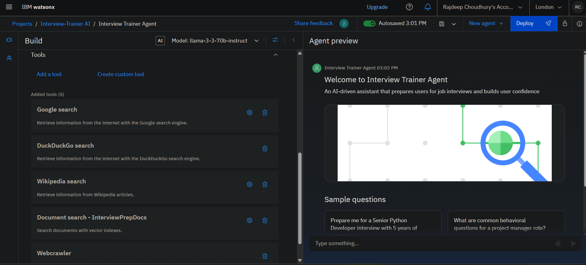

# Interview Trainer Agent with IBM Cloud watsonx.ai


## Overview

**Interview Trainer Agent** is an AI-powered, interactive mock interview solution built entirely in IBM Cloud watsonx.ai Studio. This repository contains all notebooks, assets, and resources needed to deploy, customize, and use the agent for automated interview practice and evaluation.

The project leverages IBM's watsonx.ai platform for prompt engineering, large language model integration, and seamless cloud execution, providing users with an intelligent, scalable, and cost-effective way to prepare for interviews.

---

## Features

- **Conversational Interview Simulation:** Realistic interview Q&A sessions powered by foundation models (LLMs) on IBM watsonx.ai.
- **Automated Feedback:** Instant evaluation on candidate responses, with suggestions for improvement.
- **Customizable Knowledge Base:** Easily expand or update interview questions and evaluation criteria.
- **Cloud-based Execution:** No local setup required—runs fully in IBM Cloud watsonx.ai Studio.
- **Visualizations & Analytics:** Monitor and analyze interview performance (notebooks can be extended for analytics).
- **Deployment Notebook:** Step-by-step guide to deploy and access the agent in your IBM Cloud environment.

---

## Repository Structure

- `Interview Trainer Agent code.ipynb`  
  Main notebook: logic for the interactive interview agent (prompt templates, interaction flow, response evaluation).

- `Interview Agent Deployment code.ipynb`  
  Step-by-step deployment notebook: how to set up, configure, and run the agent in IBM Cloud watsonx.ai Studio.

- `InterviewAgent_Knowledge-Base.pdf`  
  Example knowledge base of questions and answers.

- `ibm cloud AI Agent ppt.pdf`  
  Project presentation slides.

- `deployed.png`, `deployed_preview.png`, `setup & config.png`, `tools.png`  
  Screenshots and visuals showing the agent UI, deployment, and configuration.

- `ibm skillsbuild certifications/`  
  Related IBM SkillsBuild certifications (if provided).

- `preview results' images/`  
  Additional result preview images.

---

## Getting Started

### Prerequisites

- IBM Cloud account with watsonx.ai access
- Basic familiarity with Jupyter Notebooks
- (Optional) Knowledge of prompt engineering for LLMs

### Quick Start

1. **Clone this repository:**
   ```bash
   git clone https://github.com/Raj17deep/Interview-Trainer-Agent-IBM-Cloud.git
   ```

2. **Open IBM Cloud watsonx.ai Studio:**
   - Create/open a project.
   - Upload the provided notebooks and assets.

3. **Run the Notebooks in Sequence:**
   - Start with `Interview Agent Deployment code.ipynb` to set up the environment.
   - Proceed to `Interview Trainer Agent code.ipynb` to start using the agent.

4. **(Optional) Update Knowledge Base:**
   - Edit the knowledge base PDF or notebook cells to add/remove questions.

5. **Test & Customize:**
   - Run mock interviews, analyze feedback, and tune prompts as needed.

---

## Customization

- **Prompt Engineering:** Modify prompt cells in the notebook to tailor interview style or evaluation.
- **Question Sets:** Expand the knowledge base with your own domain-specific questions.
- **Model Selection:** Use any available LLM on IBM watsonx.ai (adjust notebook as needed).

---

## Screenshots




---

## Resources

- [IBM watsonx.ai Documentation](https://www.ibm.com/products/watsonx-ai)
- Sample knowledge base: `InterviewAgent_Knowledge-Base.pdf`
- Project slides: `ibm cloud AI Agent ppt.pdf`

---

## License

This project does not specify a license. Please contact [Raj17deep](https://github.com/Raj17deep) for usage permissions.

---

## Author

- **GitHub:** [Raj17deep](https://github.com/Raj17deep)

---

> AI interview training made easy—deploy, customize, and practice in the cloud!
